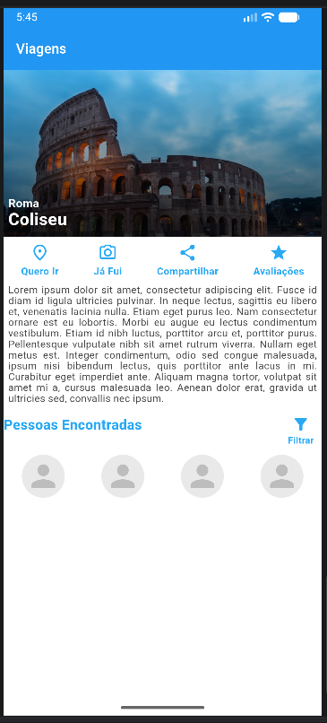

# Atividade Final - Unidade 1

Atividade final da Unidade 1 da disciplina Programação para Dispositivos Móveis (PDM).

O objetivo foi desenvolver uma tela no Flutter reproduzindo um layout fornecido pelo professor.

**Autora:** Beatriz Almeida de Souza Silva

## Screenshot

